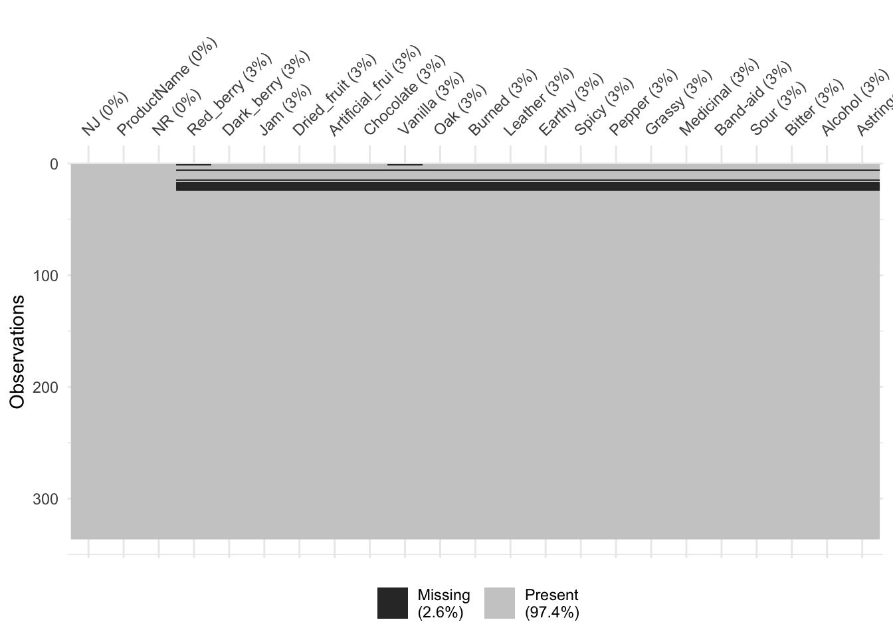

# Dealing with missing data

In this short section, we'll look at "single imputation" using the Expectation Maximization approach.  First, let's get our data imported and our packages set up.


```r
library(tidyverse)
library(here)

descriptive_data <- read_csv(here("data/torriDAFinal.csv"))
missing_data_example <-read_csv(here("data/torrimiss.csv"))
```

## Exploring missing data

In the original **R Opus**, HGH used the `missmda` package, from Susan Josse and Francois Husson, which to my understanding uses a PCA approach to do single imputation.  Reading through their documentation, they note that this is equivalent to the "expectation maximization" (EM) approach to single imputation.  We're going to use a slightly more modern package that combines approaches from a number of different missing-data packages, called `simputation`.  It gives standard syntax for a number of different formula-based methods for imputation.  We're going to also use the `skimr` package to easily see where we have missing data, and the `naniar` package to visualize.


```r
library(simputation)
library(skimr)
library(naniar)
```

First off, let's take a look at our `missing_data_example` data set using the `skim()` method.


```r
skim(missing_data_example) %>% 
  # This is purely to allow the skimr::skim() to be rendered in PDF, ignore otherwise
  knitr::kable()
```


|skim_type |skim_variable   | n_missing| complete_rate| character.min| character.max| character.empty| character.n_unique| character.whitespace| numeric.mean| numeric.sd| numeric.p0| numeric.p25| numeric.p50| numeric.p75| numeric.p100|numeric.hist |
|:---------|:---------------|---------:|-------------:|-------------:|-------------:|---------------:|------------------:|--------------------:|------------:|----------:|----------:|-----------:|-----------:|-----------:|------------:|:------------|
|character |ProductName     |         0|     1.0000000|             7|            11|               0|                  8|                    0|           NA|         NA|         NA|          NA|          NA|          NA|           NA|NA           |
|numeric   |NJ              |         0|     1.0000000|            NA|            NA|              NA|                 NA|                   NA| 1403.3571429| 20.8589537|       1331|    1402.000|     1408.50|    1414.000|       1417.0|▁▁▁▁▇        |
|numeric   |NR              |         0|     1.0000000|            NA|            NA|              NA|                 NA|                   NA|    8.0000000|  0.8177143|          7|       7.000|        8.00|       9.000|          9.0|▇▁▇▁▇        |
|numeric   |Red_berry       |        11|     0.9672619|            NA|            NA|              NA|                 NA|                   NA|    2.8473846|  2.5294746|          0|       0.500|        2.30|       4.800|          9.2|▇▅▂▂▁        |
|numeric   |Dark_berry      |        10|     0.9702381|            NA|            NA|              NA|                 NA|                   NA|    3.0953988|  2.7778038|          0|       0.500|        2.30|       5.075|          9.9|▇▃▃▂▂        |
|numeric   |Jam             |        10|     0.9702381|            NA|            NA|              NA|                 NA|                   NA|    1.8773006|  2.4022502|          0|       0.200|        0.70|       2.700|         10.0|▇▂▁▁▁        |
|numeric   |Dried_fruit     |        10|     0.9702381|            NA|            NA|              NA|                 NA|                   NA|    1.8104294|  2.1395934|          0|       0.200|        0.70|       3.275|         10.0|▇▂▂▁▁        |
|numeric   |Artificial_frui |        10|     0.9702381|            NA|            NA|              NA|                 NA|                   NA|    1.1996933|  1.9710598|          0|       0.100|        0.30|       1.200|          9.7|▇▁▁▁▁        |
|numeric   |Chocolate       |        10|     0.9702381|            NA|            NA|              NA|                 NA|                   NA|    1.2131902|  1.7648302|          0|       0.100|        0.40|       1.675|         10.0|▇▁▁▁▁        |
|numeric   |Vanilla         |        11|     0.9672619|            NA|            NA|              NA|                 NA|                   NA|    1.6673846|  1.9758529|          0|       0.200|        0.90|       2.600|          9.3|▇▂▁▁▁        |
|numeric   |Oak             |        10|     0.9702381|            NA|            NA|              NA|                 NA|                   NA|    2.3024540|  1.9957632|          0|       0.500|        1.70|       3.900|          9.0|▇▃▃▁▁        |
|numeric   |Burned          |        10|     0.9702381|            NA|            NA|              NA|                 NA|                   NA|    1.5070552|  2.0622868|          0|       0.100|        0.40|       2.375|          9.7|▇▂▁▁▁        |
|numeric   |Leather         |        10|     0.9702381|            NA|            NA|              NA|                 NA|                   NA|    1.4659509|  2.0566530|          0|       0.100|        0.40|       2.400|          9.9|▇▂▁▁▁        |
|numeric   |Earthy          |        10|     0.9702381|            NA|            NA|              NA|                 NA|                   NA|    1.0929448|  1.5826888|          0|       0.100|        0.40|       1.375|          8.0|▇▁▁▁▁        |
|numeric   |Spicy           |        10|     0.9702381|            NA|            NA|              NA|                 NA|                   NA|    1.2015337|  1.6742477|          0|       0.100|        0.40|       1.800|          8.9|▇▂▁▁▁        |
|numeric   |Pepper          |        10|     0.9702381|            NA|            NA|              NA|                 NA|                   NA|    1.5165644|  2.0514989|          0|       0.200|        0.50|       2.300|         10.0|▇▁▁▁▁        |
|numeric   |Grassy          |        10|     0.9702381|            NA|            NA|              NA|                 NA|                   NA|    0.9361963|  1.4584638|          0|       0.100|        0.30|       1.100|          9.8|▇▁▁▁▁        |
|numeric   |Medicinal       |        10|     0.9702381|            NA|            NA|              NA|                 NA|                   NA|    1.4276074|  2.0269504|          0|       0.100|        0.40|       2.000|          9.6|▇▁▁▁▁        |
|numeric   |Band-aid        |        10|     0.9702381|            NA|            NA|              NA|                 NA|                   NA|    1.2061350|  2.0478189|          0|       0.100|        0.30|       1.075|          9.8|▇▁▁▁▁        |
|numeric   |Sour            |        10|     0.9702381|            NA|            NA|              NA|                 NA|                   NA|    4.6199387|  2.9908889|          0|       1.625|        4.85|       7.100|         10.0|▇▅▇▆▅        |
|numeric   |Bitter          |        10|     0.9702381|            NA|            NA|              NA|                 NA|                   NA|    3.4236196|  2.7514405|          0|       1.000|        3.00|       5.200|         10.0|▇▅▃▂▂        |
|numeric   |Alcohol         |        10|     0.9702381|            NA|            NA|              NA|                 NA|                   NA|    3.6058282|  2.4028950|          0|       1.200|        4.05|       5.200|          9.5|▇▃▇▃▁        |
|numeric   |Astringent      |        10|     0.9702381|            NA|            NA|              NA|                 NA|                   NA|    4.6358896|  2.6451989|          0|       2.500|        4.70|       6.400|         10.0|▆▆▇▅▃        |

This shows us that we have (induced) missingness in all of our outcome variables (the sensory descriptors), but our predictors (`ProductName`, `NJ`, and `NR`) have no missingness, which is good.  It also shows us that we need to `mutate()` the latter two of those 3 variables into factors, as right now `R` will treat them as numeric predictors.


```r
# Here we mutate the first 3 variables to all be factors
missing_data_example <- 
  missing_data_example %>%
  mutate_at(vars(1:3), ~as.factor(.))

# let's also fix this in our complete dataset before we forget
descriptive_data <-
  descriptive_data %>%
  mutate_at(vars(1:3), ~as.factor(.))
```

We can then get a look at the patternness of missingness using `naniar`, which has a bunch of utilities for easily visualizing missing data.


```r
missing_data_example %>%
  vis_miss()
```



```r
# We see above that HGH just replaced some rows with NAs.  In this case, the
# data is NOT missing "completely at random", as we can confirm with a
# statistical test.
missing_data_example %>%
  mcar_test()
```

```
## # A tibble: 1 × 4
##   statistic    df  p.value missing.patterns
##       <dbl> <dbl>    <dbl>            <int>
## 1      57.7    24 0.000133                3
```

As we know that every row in our dataset is a "case" rather than an observation (i.e., our data is *wide* rather than *long*), we can use the `miss_case_summary()` function from `naniar` to give us a bit more info about how the missingness was introduced:


```r
missing_data_example %>%
  miss_case_summary() %>%
  filter(n_miss > 0)
```

```
## # A tibble: 11 × 3
##     case n_miss pct_miss
##    <int>  <int>    <dbl>
##  1     6     20    87.0 
##  2    15     20    87.0 
##  3    17     20    87.0 
##  4    18     20    87.0 
##  5    19     20    87.0 
##  6    20     20    87.0 
##  7    21     20    87.0 
##  8    22     20    87.0 
##  9    23     20    87.0 
## 10    24     20    87.0 
## 11     1      2     8.70
```

The problem of missing data is a complex one, and if you have large quantities of missing data you will need to account for it in your reports.  In this case, however, we're just going to accept the missingness (perhaps those subjects missed those sessions) and move on.

## Imputing missing data

I am certainly no expert on missing data, but [after doing some reading into the package HGH used in the original **R Opus**, `missMDA`](https://www.jstatsoft.org/article/view/v070i01), my understanding is that this package uses a Principal Component Analysis (PCA)-based approach to imputation which is both useful for the unique problems that sensory scientists typically tackle (e.g., dealing with highly multivariate data with high uncertainty and high multicollinearity) and is competitive with current methods.  Therefore, we'll use this package for imputation here, as well as showing some alternatives below.


```r
library(missMDA)

# We can first estimate the number of components to use in our imputation.
# NB: This may take a few minutes.
estim_ncpFAMD(missing_data_example, verbose = FALSE)
```

```
## $ncp
## [1] 5
## 
## $criterion
##          0          1          2          3          4          5 
## 0.07078424 0.05823393 0.05189168 0.04860049 0.04636652 0.04513273
```

```r
# Then we run the imputation itself with the recommended number of components.
# In contrast to the original R Opus, which used ncp = 2, this function
# recommends we use ncp = 5.

missing_data_imputed <- imputeFAMD(missing_data_example, ncp = 5)

missing_data_imputed$completeObs %>%
  as_tibble()
```

```
## # A tibble: 336 × 23
##    NJ    ProductName NR    Red_berry Dark_berry   Jam Dried_fruit
##    <fct> <fct>       <fct>     <dbl>      <dbl> <dbl>       <dbl>
##  1 1331  C_MERLOT    7          4.71       5.8   2.1         4.7 
##  2 1331  C_SYRAH     7          5.6        1.9   3.9         1.2 
##  3 1331  C_ZINFANDEL 7          4.9        2.6   1.4         5.9 
##  4 1331  C_REFOSCO   7          5          1.9   7.8         0.6 
##  5 1331  I__MERLOT   7          3.3        7.2   0.5         5.8 
##  6 1331  I_SYRAH     7          4.02       5.01  4.41        2.86
##  7 1331  I_PRIMITIVO 7          2.9        5.1   8.7         0.4 
##  8 1331  I_REFOSCO   7          3.2        6     4           0.7 
##  9 1400  C_MERLOT    7          0.1        0.1   0.2         2.9 
## 10 1400  C_SYRAH     7          1.6        0.7   0           6.4 
## # ℹ 326 more rows
## # ℹ 16 more variables: Artificial_frui <dbl>, Chocolate <dbl>, Vanilla <dbl>,
## #   Oak <dbl>, Burned <dbl>, Leather <dbl>, Earthy <dbl>, Spicy <dbl>,
## #   Pepper <dbl>, Grassy <dbl>, Medicinal <dbl>, `Band-aid` <dbl>, Sour <dbl>,
## #   Bitter <dbl>, Alcohol <dbl>, Astringent <dbl>
```

We see that values have been filled in.  Let's compare them to our original data visually.


```r
descriptive_data
```

```
## # A tibble: 336 × 23
##    NJ    ProductName NR    Red_berry Dark_berry   Jam Dried_fruit
##    <fct> <fct>       <fct>     <dbl>      <dbl> <dbl>       <dbl>
##  1 1331  C_MERLOT    7           5.1        5.8   2.1         4.7
##  2 1331  C_SYRAH     7           5.6        1.9   3.9         1.2
##  3 1331  C_ZINFANDEL 7           4.9        2.6   1.4         5.9
##  4 1331  C_REFOSCO   7           5          1.9   7.8         0.6
##  5 1331  I_MERLOT    7           3.3        7.2   0.5         5.8
##  6 1331  I_SYRAH     7           5.7        3.6   8.7         1.9
##  7 1331  I_PRIMITIVO 7           2.9        5.1   8.7         0.4
##  8 1331  I_REFOSCO   7           3.2        6     4           0.7
##  9 1400  C_MERLOT    7           0.1        0.1   0.2         2.9
## 10 1400  C_SYRAH     7           1.6        0.7   0           6.4
## # ℹ 326 more rows
## # ℹ 16 more variables: Artificial_frui <dbl>, Chocolate <dbl>, Vanilla <dbl>,
## #   Oak <dbl>, Burned <dbl>, Leather <dbl>, Earthy <dbl>, Spicy <dbl>,
## #   Pepper <dbl>, Grassy <dbl>, Medicinal <dbl>, `Band-aid` <dbl>, Sour <dbl>,
## #   Bitter <dbl>, Alcohol <dbl>, Astringent <dbl>
```

In the first row, both `Red_berry` and `Vanilla` were imputed.  These get reasonably close.  Let's compare the results of an ANOVA on the `Red_berry` variable for the imputed and the original data.


```r
# Imputed data
aov(Red_berry ~ (ProductName + NJ + NR)^2, 
    data = missing_data_imputed$completeObs) %>%
  summary()
```

```
##                 Df Sum Sq Mean Sq F value   Pr(>F)    
## ProductName      7   84.4   12.06   3.546  0.00135 ** 
## NJ              13  599.8   46.14  13.571  < 2e-16 ***
## NR               2    2.9    1.46   0.429  0.65189    
## ProductName:NJ  91  639.7    7.03   2.068 1.76e-05 ***
## ProductName:NR  14   47.9    3.42   1.005  0.44992    
## NJ:NR           26   93.0    3.58   1.052  0.40305    
## Residuals      182  618.8    3.40                     
## ---
## Signif. codes:  0 '***' 0.001 '**' 0.01 '*' 0.05 '.' 0.1 ' ' 1
```

```r
# Complete data
aov(Red_berry ~ (ProductName + NJ + NR)^2, 
    data = descriptive_data) %>%
  summary()
```

```
##                 Df Sum Sq Mean Sq F value   Pr(>F)    
## ProductName      7   73.2   10.45   2.914  0.00652 ** 
## NJ              13  597.9   45.99  12.821  < 2e-16 ***
## NR               2    2.9    1.43   0.398  0.67201    
## ProductName:NJ  91  659.0    7.24   2.019 3.18e-05 ***
## ProductName:NR  14   52.2    3.73   1.040  0.41539    
## NJ:NR           26   97.2    3.74   1.042  0.41565    
## Residuals      182  652.8    3.59                     
## ---
## Signif. codes:  0 '***' 0.001 '**' 0.01 '*' 0.05 '.' 0.1 ' ' 1
```

You'll notice that the *p*-value for the imputed data is actually lower!  But this is an artifact, as we have not adjusted our degrees of freedom--we need to reduce our numerator degrees of freedom to account for the number of imputed values, as those values are based on the other, observed values.  This will reverse this trend.  We'd see something similar in the rest of the data set.

## Alternative approaches to imputation

While it is powerful, `missMDA` is not very fast, and may not be the best tool for imputation in all cases.  In general, the `simputation` package has a really easy to use interface, which you can learn about by using `vignette("intro", package = "simputation")`.  It offers a lot of competitive methods.  For example, let's use a multiple regression model to predict missing variables in the dataset.

Something I've found with `simputation` is that it is flummoxed by non-syntactic names in `R`, such as `Band-aid` (you cannot typically use "-" in a name in `R`).  We're going to quickly fix the names of our dataset in order to make it play nice before we proceed.


```r
missing_data_imputed_lm <-
  missing_data_example %>%
  rename_all(~str_replace_all(., "-", "_")) %>%
  impute_lm(formula = . ~ ProductName + NR + NJ)
```

If we run the same checks as before on `Red_berry`, let's see what we get:


```r
# Imputed data
aov(Red_berry ~ (ProductName + NJ + NR)^2, 
    data = missing_data_imputed_lm) %>%
  summary()
```

```
##                 Df Sum Sq Mean Sq F value   Pr(>F)    
## ProductName      7   90.1   12.87   3.798 0.000714 ***
## NJ              13  614.3   47.25  13.948  < 2e-16 ***
## NR               2    3.4    1.68   0.496 0.609491    
## ProductName:NJ  91  638.7    7.02   2.072 1.67e-05 ***
## ProductName:NR  14   48.3    3.45   1.018 0.437183    
## NJ:NR           26   89.3    3.43   1.014 0.451877    
## Residuals      182  616.6    3.39                     
## ---
## Signif. codes:  0 '***' 0.001 '**' 0.01 '*' 0.05 '.' 0.1 ' ' 1
```

```r
# Complete data
aov(Red_berry ~ (ProductName + NJ + NR)^2, 
    data = descriptive_data) %>%
  summary()
```

```
##                 Df Sum Sq Mean Sq F value   Pr(>F)    
## ProductName      7   73.2   10.45   2.914  0.00652 ** 
## NJ              13  597.9   45.99  12.821  < 2e-16 ***
## NR               2    2.9    1.43   0.398  0.67201    
## ProductName:NJ  91  659.0    7.24   2.019 3.18e-05 ***
## ProductName:NR  14   52.2    3.73   1.040  0.41539    
## NJ:NR           26   97.2    3.74   1.042  0.41565    
## Residuals      182  652.8    3.59                     
## ---
## Signif. codes:  0 '***' 0.001 '**' 0.01 '*' 0.05 '.' 0.1 ' ' 1
```

Why is our *p*-value even smaller?  If you think about it, we've filled in missing values *using a linear model like the one we are analyzing*.  Therefore, our hypothesis--that ratings for descriptors depend on the wine, the judge, and the rep--is leaking into our imputation.  This is one reason it's critical to adjust our degrees of freedom for any hypothesis tests we use on these imputed data... or to use non-parametric models for imputation (like the ones from `missMDA`) that don't encode our hypotheses in the first place.

## Packages used in this chapter


```r
sessionInfo()
```

```
## R version 4.3.1 (2023-06-16)
## Platform: aarch64-apple-darwin20 (64-bit)
## Running under: macOS Ventura 13.6.1
## 
## Matrix products: default
## BLAS:   /Library/Frameworks/R.framework/Versions/4.3-arm64/Resources/lib/libRblas.0.dylib 
## LAPACK: /Library/Frameworks/R.framework/Versions/4.3-arm64/Resources/lib/libRlapack.dylib;  LAPACK version 3.11.0
## 
## locale:
## [1] en_US.UTF-8/en_US.UTF-8/en_US.UTF-8/C/en_US.UTF-8/en_US.UTF-8
## 
## time zone: America/New_York
## tzcode source: internal
## 
## attached base packages:
## [1] stats     graphics  grDevices utils     datasets  methods   base     
## 
## other attached packages:
##  [1] missMDA_1.18      naniar_1.0.0      skimr_2.1.5       simputation_0.2.8
##  [5] here_1.0.1        lubridate_1.9.2   forcats_1.0.0     stringr_1.5.0    
##  [9] dplyr_1.1.2       purrr_1.0.1       readr_2.1.4       tidyr_1.3.0      
## [13] tibble_3.2.1      ggplot2_3.4.3     tidyverse_2.0.0  
## 
## loaded via a namespace (and not attached):
##  [1] rlang_1.1.1          magrittr_2.0.3       compiler_4.3.1      
##  [4] vctrs_0.6.3          pkgconfig_2.0.3      shape_1.4.6         
##  [7] crayon_1.5.2         fastmap_1.1.1        backports_1.4.1     
## [10] labeling_0.4.3       utf8_1.2.3           rmarkdown_2.23      
## [13] tzdb_0.4.0           nloptr_2.0.3         visdat_0.6.0        
## [16] bit_4.0.5            xfun_0.39            glmnet_4.1-8        
## [19] jomo_2.7-6           cachem_1.0.8         jsonlite_1.8.7      
## [22] flashClust_1.01-2    highr_0.10           pan_1.9             
## [25] broom_1.0.5          parallel_4.3.1       cluster_2.1.4       
## [28] R6_2.5.1             bslib_0.5.1          stringi_1.7.12      
## [31] boot_1.3-28.1        rpart_4.1.19         jquerylib_0.1.4     
## [34] estimability_1.4.1   Rcpp_1.0.11          bookdown_0.37       
## [37] iterators_1.0.14     knitr_1.43           base64enc_0.1-3     
## [40] Matrix_1.6-0         splines_4.3.1        nnet_7.3-19         
## [43] timechange_0.2.0     tidyselect_1.2.0     rstudioapi_0.15.0   
## [46] yaml_2.3.7           doParallel_1.0.17    codetools_0.2-19    
## [49] lattice_0.21-8       withr_2.5.0          coda_0.19-4         
## [52] evaluate_0.21        survival_3.5-5       norm_1.0-11.1       
## [55] pillar_1.9.0         mice_3.16.0          DT_0.28             
## [58] foreach_1.5.2        generics_0.1.3       vroom_1.6.3         
## [61] rprojroot_2.0.3      hms_1.1.3            munsell_0.5.0       
## [64] scales_1.2.1         minqa_1.2.5          xtable_1.8-4        
## [67] leaps_3.1            glue_1.6.2           emmeans_1.8.7       
## [70] scatterplot3d_0.3-44 tools_4.3.1          lme4_1.1-34         
## [73] gower_1.0.1          mvtnorm_1.2-2        grid_4.3.1          
## [76] colorspace_2.1-0     nlme_3.1-162         repr_1.1.6          
## [79] cli_3.6.1            fansi_1.0.4          gtable_0.3.4        
## [82] sass_0.4.7           digest_0.6.33        ggrepel_0.9.3       
## [85] FactoMineR_2.8       htmlwidgets_1.6.2    farver_2.1.1        
## [88] htmltools_0.5.6      lifecycle_1.0.3      multcompView_0.1-9  
## [91] mitml_0.4-5          bit64_4.0.5          MASS_7.3-60
```
