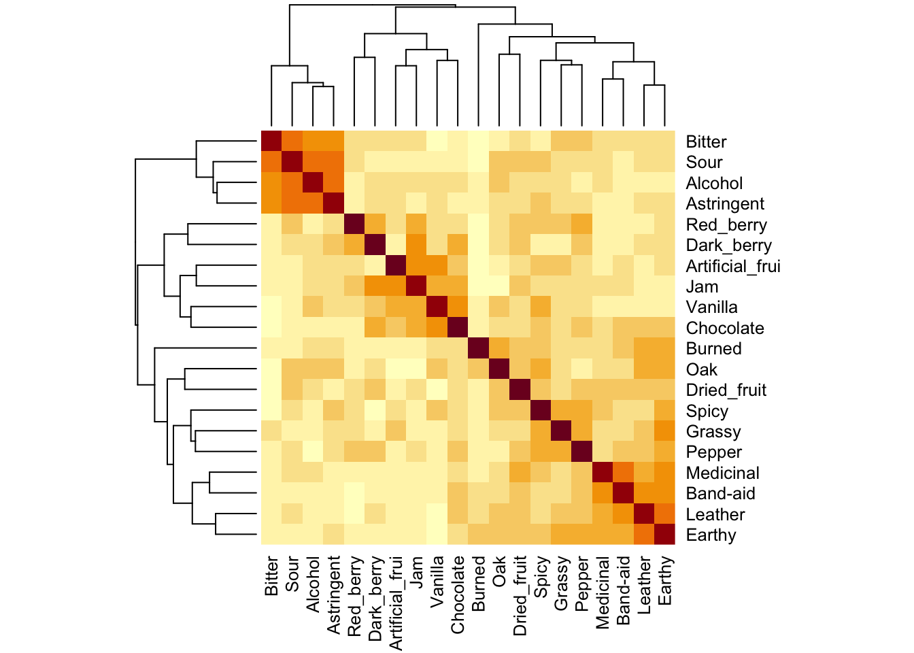
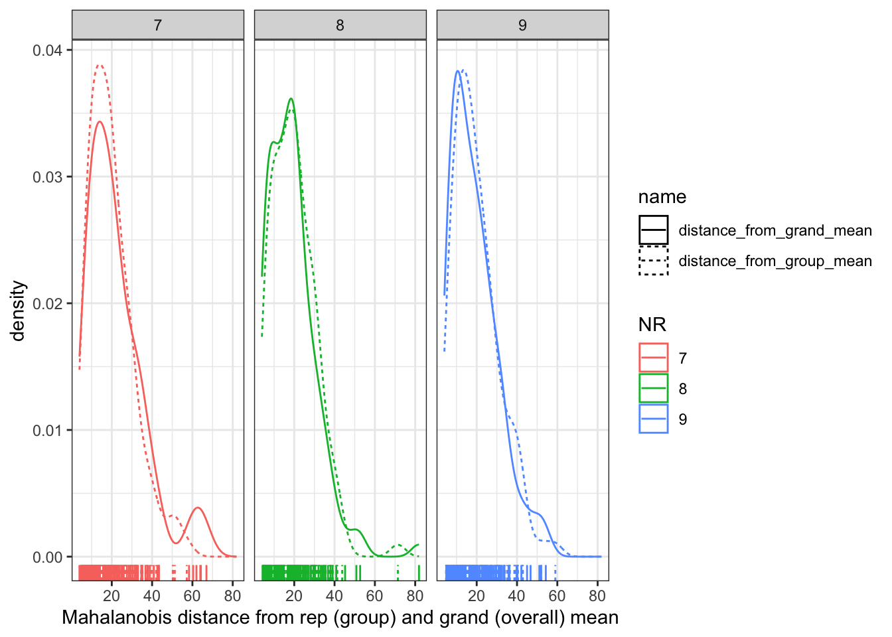
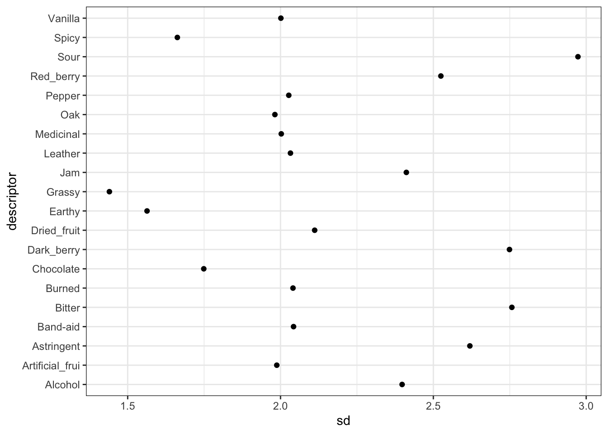
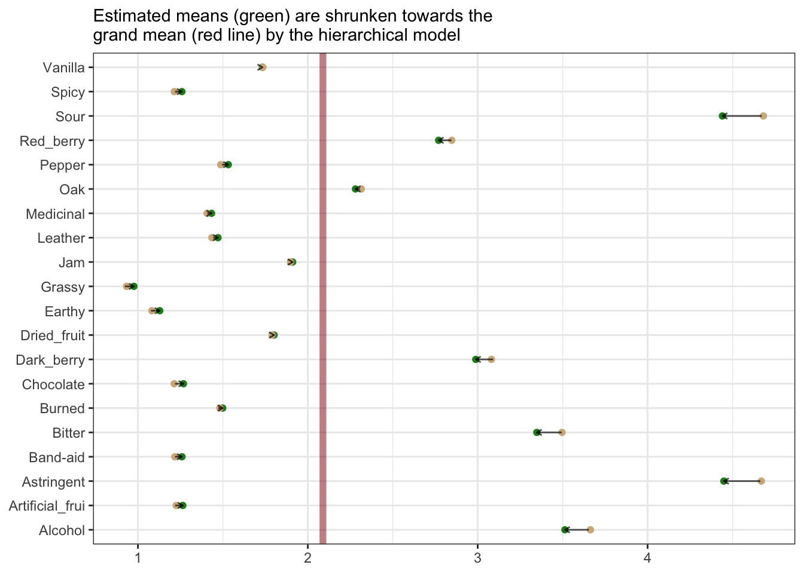
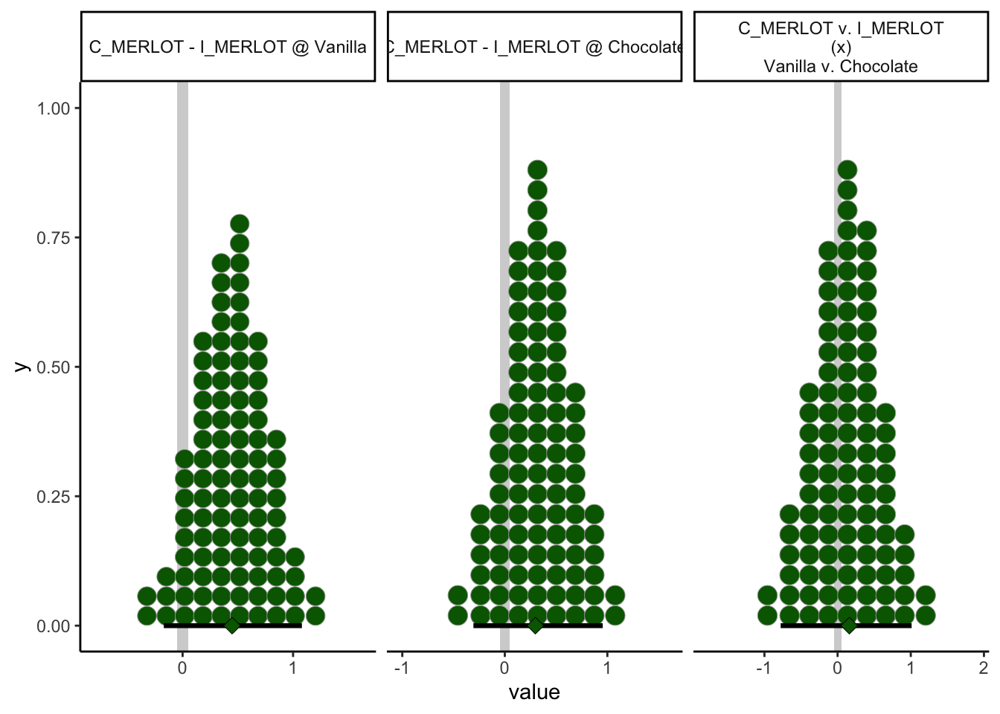

# MANOVA (Multivariate Analysis of Variance)

In this extremely brief section we'll apply a multivariate ANOVA (MANOVA) to our data.  MANOVA analyzes changes in the mean vectors of outcome variables based on categorical factors.  We'll spend slightly more time than HGH did in the original **R Opus** on these concepts, although *only* slightly.

First, let's reload our packages and data:


```r
library(tidyverse)
library(here)

descriptive_data <- read_csv(here("data/torriDAFinal.csv")) %>%
  
  # Don't forget to change the independent variables here to factors...
  
  mutate_at(.vars = vars(1:3), ~as.factor(.))
```

## Running MANOVA

The syntax for MANOVA in `R` is very similar to that for ANOVA.  However, as far as I know there isn't a *great* way to use a tidy approach with `map()` and `nest()` to get `manova()` to work; from what I can tell, this has to do with `R`'s formula syntax: we can't easily specify the outcome variable (on the left side of the `~` in the formula) using the named elements of a typical `R` formula as we did in the ANOVA section.  There, we could write a formula like `rating ~ ProductName` (I'm simplifying to save myself typing).  `R` is able to interpret a single name in the formula syntax, but it will not parse something like `Red_berry:Astringent ~ ProductName`, which would be necessary for MANOVA.  

Instead, we have to supply the multivariate outcomes as a (named) matrix *in the same (case or wide) order* as the categorical predictors.  Since we don't really need this for anything else, we'll use nested function calls.  


```r
manova_res <- 
  manova(as.matrix(descriptive_data[, 4:23]) ~ (ProductName + NJ + NR)^2, 
         data = descriptive_data)
```

We can get a summary MANOVA table using the typical `summary()` function.  


```r
summary(manova_res, test = "W")
```

```
##                 Df   Wilks approx F num Df den Df    Pr(>F)    
## ProductName      7 0.04243   4.7575    140 1093.6 < 2.2e-16 ***
## NJ              13 0.00001  12.5493    260 1819.7 < 2.2e-16 ***
## NR               2 0.64784   1.9756     40  326.0 0.0007056 ***
## ProductName:NJ  91 0.00000   1.7583   1820 3331.1 < 2.2e-16 ***
## ProductName:NR  14 0.22673   0.9414    280 1916.9 0.7387371    
## NJ:NR           26 0.02215   1.3926    520 2672.6 1.873e-07 ***
## Residuals      182                                             
## ---
## Signif. codes:  0 '***' 0.001 '**' 0.01 '*' 0.05 '.' 0.1 ' ' 1
```

The `test = "W"` argument asks for Wilk's $\Lambda$, which is for whatever reason the preferred test in sensory evaluation (HGH also prefers it).  The default test provided by `R` is Pillai's $V$.  Only in rare edge cases will the two tests disagree, which you are unlikely to encounter.

In this particular case, we see that there are significant differences in group mean vectors for wine (`ProductName`) and judge (`NJ`), as well as an interaction effect (`ProductName:NJ`).

## What does MANOVA test?

This isn't a statistics course.  But I do feel that HGH didn't give much detail in the original **R Opus**, so let's take a second to think about MANOVA (and practice some wrangling while we're at it).

In typical ANOVA, we are interested in whether knowing the categorical predictor variables tells us something about expected value for an observation.  In our case, we might want to know if knowing the wine identity (`C_ZINFANDEL` for example) tells us something about the expected level of a sensory descriptor (for example, `Red_berry`).  With elaboration, this is always the question we are answering with ANOVA.

What are we measuring in MANOVA?  Well, if we treat our data in the wide, case-based way, we are asking whether the categorical predictor variables tell us anything about *all of the expected values, simultaneously*.  This makes a lot of sense for our particular case: we might expect correlations among variables, and so rather than investigating variables one-by-one, as we did when we ran ANOVA, we want to take advantage of this *correlation structure*.


```r
descriptive_data[, 4:23] %>%
  cor() %>% 
  heatmap(revC = TRUE)
```



Without getting too outside our remit in the **R Opus**, MANOVA attemps to explain the variation of individual observations from their *group mean-vectors*.  A "mean-vector" is just the mean of all dependent variables for a particular set of classifying categorical predictors.  So, for our data, the dependent variables are all the sensory variables.  We (generally) are interested in the variation around the **wine** mean-vectors.  We can see these easily using the split-apply-combine approach:


```r
wine_mean_vectors <- 
  descriptive_data %>%
  group_by(ProductName) %>%
  summarize_if(.predicate = ~is.numeric(.),
               .funs = ~mean(.))

wine_mean_vectors
```

```
## # A tibble: 8 × 21
##   ProductName Red_berry Dark_berry   Jam Dried_fruit Artificial_frui Chocolate
##   <fct>           <dbl>      <dbl> <dbl>       <dbl>           <dbl>     <dbl>
## 1 C_MERLOT         2.46       3.05 1.37         1.86           0.776     1.19 
## 2 C_REFOSCO        2.47       2.46 1.03         1.42           0.924     2.00 
## 3 C_SYRAH          2.46       2.93 1.75         1.68           0.883     1.42 
## 4 C_ZINFANDEL      3.08       3.06 1.98         2.06           0.864     0.969
## 5 I_MERLOT         2.79       2.35 0.843        1.85           0.574     0.783
## 6 I_PRIMITIVO      3.85       3.38 3.61         1.44           2.19      1.38 
## 7 I_REFOSCO        2.48       3.01 1.54         1.87           1.11      0.810
## 8 I_SYRAH          3.17       4.48 3.10         2.16           2.43      1.20 
## # ℹ 14 more variables: Vanilla <dbl>, Oak <dbl>, Burned <dbl>, Leather <dbl>,
## #   Earthy <dbl>, Spicy <dbl>, Pepper <dbl>, Grassy <dbl>, Medicinal <dbl>,
## #   `Band-aid` <dbl>, Sour <dbl>, Bitter <dbl>, Alcohol <dbl>, Astringent <dbl>
```

We want to know whether an observation from a particular wine is significantly "closer" to that wine's mean-vector than it is to other wine's mean-vectors.  We test this using the [Mahalanobis Distance](https://en.wikipedia.org/wiki/Mahalanobis_distance), which is a generalization of the normalized distance (or *z*-score) from univariate statistics.  Intuitively, we ask about the (multi-dimensional) distance of an observation from a mean-vector, divided by the covariance of the observations (the multivariate equivalent of standard deviation).  Without getting into mathematics, we can ask about this distance using the `mahalanobis()` function.


```r
distance_from_grand_mean <- 
  descriptive_data[, -(1:3)] %>%
  as.matrix() %>%
  mahalanobis(x = ., center = colMeans(.), cov = cov(.))

descriptive_data %>%
  select(-NJ, -NR) %>%
  nest(data = -ProductName) %>%
  mutate(data = map(data, ~as.matrix(.x)), 
         distance_from_group_mean = map(data, ~mahalanobis(x = .x, center = colMeans(.x), cov = cov(.x)))) %>%
  select(-data) %>%
  unnest(distance_from_group_mean) %>%
  mutate(distance_from_grand_mean = distance_from_grand_mean) %>%
  pivot_longer(-ProductName) %>%
  ggplot(aes(x = value, color = ProductName, linetype = name)) +
  geom_density() +
  geom_rug() +
  theme_bw() +
  labs(x = "Mahalanobis distance from wine (group) and grand (overall) mean") +
  facet_wrap(~ProductName)
```


In this plot, we're able to see how far each individual row (observation) is, in a standardized, multivariate space, from the group mean (the dashed line) and the grand mean (the solid line).  We can see that our groups are not necessarily well-defined: often, the grand mean seems to do a better job of describing our samples than the group mean for the specific wine.  This might be a sign of our panelists needing further training, but recall that this (simple) visualization doesn't account for variance stemming from replicate and individual judge scaling behavior, nuisance factors that we actually included in the real MANOVA we ran above.  When we include these, we find that in fact group membership (the type of wine) is important for predicting the sample mean vector.


```r
descriptive_data %>%
  select(-ProductName, -NJ) %>%
  nest(data = -NR) %>%
  mutate(data = map(data, ~as.matrix(.x)), 
         distance_from_group_mean = map(data, ~mahalanobis(x = .x, center = colMeans(.x), cov = cov(.x)))) %>%
  select(-data) %>%
  unnest(distance_from_group_mean) %>%
  mutate(distance_from_grand_mean = distance_from_grand_mean) %>%
  pivot_longer(-NR) %>%
  ggplot(aes(x = value, color = NR, linetype = name)) +
  geom_density() +
  geom_rug() +
  theme_bw() +
  labs(x = "Mahalanobis distance from rep (group) and grand (overall) mean") +
  facet_wrap(~NR)
```



Here we can see that the distribution is almost identical, meaning that knowing what replication (`NR`) the observation comes from gives us almost no new information.  This is good news, because we don't *want* the replication to predict anything about the sensory quality of our wines!  

We would display the same plot for our judges (`NJ`), but some of our judges are TOO repeatable: they have singular covariance matrices (we can tell because the determinant of their covariance matrices is 0), which indicates that the rank of their covariance matrix is less than the number of attributes.  This in turn leads to a situation in which their product descriptions are lower-dimensional than the data.


```r
descriptive_data %>%
  select(-ProductName, -NR) %>%
  nest(data = -NJ) %>%
  mutate(data = map(data, ~as.matrix(.x)),
         covariance_matrix = map(data, ~cov(.x)),
         determinant = map_dbl(covariance_matrix, ~det(.x)))
```

```
## # A tibble: 14 × 4
##    NJ    data            covariance_matrix determinant
##    <fct> <list>          <list>                  <dbl>
##  1 1331  <dbl [24 × 20]> <dbl [20 × 20]>      5.21e+ 2
##  2 1400  <dbl [24 × 20]> <dbl [20 × 20]>      1.86e- 6
##  3 1401  <dbl [24 × 20]> <dbl [20 × 20]>      1.57e-10
##  4 1402  <dbl [24 × 20]> <dbl [20 × 20]>      1.56e-16
##  5 1404  <dbl [24 × 20]> <dbl [20 × 20]>      0       
##  6 1405  <dbl [24 × 20]> <dbl [20 × 20]>      5.16e- 1
##  7 1408  <dbl [24 × 20]> <dbl [20 × 20]>      2.73e-21
##  8 1409  <dbl [24 × 20]> <dbl [20 × 20]>      5.75e-13
##  9 1412  <dbl [24 × 20]> <dbl [20 × 20]>      3.09e- 3
## 10 1413  <dbl [24 × 20]> <dbl [20 × 20]>      0       
## 11 1414  <dbl [24 × 20]> <dbl [20 × 20]>      1.68e- 8
## 12 1415  <dbl [24 × 20]> <dbl [20 × 20]>      5.55e+ 5
## 13 1416  <dbl [24 × 20]> <dbl [20 × 20]>      7.86e+ 1
## 14 1417  <dbl [24 × 20]> <dbl [20 × 20]>      1.31e- 4
```

Let's take a quick look at subject 1404's ratings:


```r
descriptive_data %>%
  filter(NJ == "1404")
```

```
## # A tibble: 24 × 23
##    NJ    ProductName NR    Red_berry Dark_berry   Jam Dried_fruit
##    <fct> <fct>       <fct>     <dbl>      <dbl> <dbl>       <dbl>
##  1 1404  C_MERLOT    7           4          5.6   0           0  
##  2 1404  C_SYRAH     7           0.5        7.5   0           4.4
##  3 1404  C_ZINFANDEL 7           4.9        7.9   0.5         1.9
##  4 1404  C_REFOSCO   7           0.3        1.8   0           0  
##  5 1404  I_MERLOT    7           0.7        5.1   0           5.2
##  6 1404  I_SYRAH     7           5.2        4     4           2.9
##  7 1404  I_PRIMITIVO 7           6.4        8.8   7.6         1  
##  8 1404  I_REFOSCO   7           3.7        4.8   3.8         3.9
##  9 1404  C_MERLOT    8           3.4        8.3   3.5         4.6
## 10 1404  C_SYRAH     8           3          8.8   3           4.3
## # ℹ 14 more rows
## # ℹ 16 more variables: Artificial_frui <dbl>, Chocolate <dbl>, Vanilla <dbl>,
## #   Oak <dbl>, Burned <dbl>, Leather <dbl>, Earthy <dbl>, Spicy <dbl>,
## #   Pepper <dbl>, Grassy <dbl>, Medicinal <dbl>, `Band-aid` <dbl>, Sour <dbl>,
## #   Bitter <dbl>, Alcohol <dbl>, Astringent <dbl>
```

Because this subject never used "Chocolate" or "Band-aid" descriptors, they end up with a rank-deficient covariance matrix:


```r
descriptive_data %>%
  filter(NJ == "1404") %>%
  select(-(1:3)) %>%
  cov() %>%
  round(2)
```

```
##                 Red_berry Dark_berry   Jam Dried_fruit Artificial_frui
## Red_berry            5.42       3.66  5.73        0.65            1.81
## Dark_berry           3.66       6.83  4.92        2.96            0.82
## Jam                  5.73       4.92  8.92        1.95            2.48
## Dried_fruit          0.65       2.96  1.95        3.61            0.22
## Artificial_frui      1.81       0.82  2.48        0.22            1.65
## Chocolate            0.00       0.00  0.00        0.00            0.00
## Vanilla              0.38       0.91 -0.48        0.22           -0.10
## Oak                 -0.28      -0.02 -2.02       -0.56           -0.66
## Burned              -4.74      -4.98 -5.14       -3.26           -1.65
## Leather             -0.29      -0.31 -0.28       -0.08           -0.09
## Earthy              -0.15      -0.20 -0.35       -0.18           -0.05
## Spicy                0.10      -0.30 -0.58       -0.19           -0.21
## Pepper              -0.53      -0.10 -1.45       -0.33           -0.53
## Grassy               0.14       0.07  0.12       -0.06            0.05
## Medicinal           -1.20      -1.46 -0.80        1.31           -0.39
## Band-aid             0.00       0.00  0.00        0.00            0.00
## Sour                -0.33       0.15 -0.72        0.81           -0.34
## Bitter              -0.10      -0.13 -0.38       -0.04           -0.20
## Alcohol             -0.29       0.37 -0.64       -0.12           -0.05
## Astringent          -0.38       0.19 -0.45        0.55           -0.26
##                 Chocolate Vanilla   Oak Burned Leather Earthy Spicy Pepper
## Red_berry               0    0.38 -0.28  -4.74   -0.29  -0.15  0.10  -0.53
## Dark_berry              0    0.91 -0.02  -4.98   -0.31  -0.20 -0.30  -0.10
## Jam                     0   -0.48 -2.02  -5.14   -0.28  -0.35 -0.58  -1.45
## Dried_fruit             0    0.22 -0.56  -3.26   -0.08  -0.18 -0.19  -0.33
## Artificial_frui         0   -0.10 -0.66  -1.65   -0.09  -0.05 -0.21  -0.53
## Chocolate               0    0.00  0.00   0.00    0.00   0.00  0.00   0.00
## Vanilla                 0    1.47  1.25  -0.72   -0.04  -0.19  0.25   0.47
## Oak                     0    1.25  2.66  -0.15   -0.03   0.02  0.47   0.66
## Burned                  0   -0.72 -0.15  10.72    0.44   0.17 -0.51   1.08
## Leather                 0   -0.04 -0.03   0.44    0.08  -0.01 -0.05   0.04
## Earthy                  0   -0.19  0.02   0.17   -0.01   0.17  0.05   0.03
## Spicy                   0    0.25  0.47  -0.51   -0.05   0.05  0.45   0.12
## Pepper                  0    0.47  0.66   1.08    0.04   0.03  0.12   0.68
## Grassy                  0    0.02 -0.01  -0.13   -0.01   0.00  0.04  -0.02
## Medicinal               0    0.11 -0.16  -2.25    0.16  -0.36  0.11  -0.56
## Band-aid                0    0.00  0.00   0.00    0.00   0.00  0.00   0.00
## Sour                    0    0.31  0.41  -2.06    0.01  -0.09  0.35   0.06
## Bitter                  0    0.10  0.29  -0.41   -0.01  -0.06  0.32  -0.02
## Alcohol                 0    0.39  0.59   0.61   -0.02  -0.03 -0.07   0.31
## Astringent              0    0.16  0.59  -0.18   -0.02  -0.01 -0.01   0.07
##                 Grassy Medicinal Band-aid  Sour Bitter Alcohol Astringent
## Red_berry         0.14     -1.20        0 -0.33  -0.10   -0.29      -0.38
## Dark_berry        0.07     -1.46        0  0.15  -0.13    0.37       0.19
## Jam               0.12     -0.80        0 -0.72  -0.38   -0.64      -0.45
## Dried_fruit      -0.06      1.31        0  0.81  -0.04   -0.12       0.55
## Artificial_frui   0.05     -0.39        0 -0.34  -0.20   -0.05      -0.26
## Chocolate         0.00      0.00        0  0.00   0.00    0.00       0.00
## Vanilla           0.02      0.11        0  0.31   0.10    0.39       0.16
## Oak              -0.01     -0.16        0  0.41   0.29    0.59       0.59
## Burned           -0.13     -2.25        0 -2.06  -0.41    0.61      -0.18
## Leather          -0.01      0.16        0  0.01  -0.01   -0.02      -0.02
## Earthy            0.00     -0.36        0 -0.09  -0.06   -0.03      -0.01
## Spicy             0.04      0.11        0  0.35   0.32   -0.07      -0.01
## Pepper           -0.02     -0.56        0  0.06  -0.02    0.31       0.07
## Grassy            0.02     -0.06        0  0.03   0.03   -0.02      -0.05
## Medicinal        -0.06      6.46        0  1.82   0.41   -0.66       0.04
## Band-aid          0.00      0.00        0  0.00   0.00    0.00       0.00
## Sour              0.03      1.82        0  1.64   0.41   -0.27       0.17
## Bitter            0.03      0.41        0  0.41   0.76    0.01       0.05
## Alcohol          -0.02     -0.66        0 -0.27   0.01    0.59       0.21
## Astringent       -0.05      0.04        0  0.17   0.05    0.21       0.52
```

The rows (columns) for "Chocolate" and "Band-aid" are exact scaled multiples of each other (they are in fact both entirely `0`), and so this matrix is of rank less than its dimensionality, leading to a singularity problem.

## BONUS: Hierarchical Bayes instead of MANOVA

In the section on [ANOVA][Analysis of Variance], we explored applying an ANOVA-like model to our rating data.  But we really have a set of correlated dependent variables:


```r
# For correlation tibbles
library(corrr)

descriptive_data %>%
  select(-c(1:3)) %>%
  correlate(quiet = TRUE)
```

```
## # A tibble: 20 × 21
##    term       Red_berry Dark_berry     Jam Dried_fruit Artificial_frui Chocolate
##    <chr>          <dbl>      <dbl>   <dbl>       <dbl>           <dbl>     <dbl>
##  1 Red_berry    NA          0.339   0.286        0.231          0.169     0.143 
##  2 Dark_berry    0.339     NA       0.420        0.294          0.111     0.359 
##  3 Jam           0.286      0.420  NA            0.247          0.438     0.385 
##  4 Dried_fru…    0.231      0.294   0.247       NA              0.145     0.256 
##  5 Artificia…    0.169      0.111   0.438        0.145         NA         0.285 
##  6 Chocolate     0.143      0.359   0.385        0.256          0.285    NA     
##  7 Vanilla       0.122      0.206   0.404        0.119          0.399     0.455 
##  8 Oak           0.113      0.183   0.0261       0.320          0.0649    0.201 
##  9 Burned       -0.0493    -0.0555 -0.0655       0.149          0.0127    0.107 
## 10 Leather       0.0668     0.184   0.116        0.340          0.0953    0.324 
## 11 Earthy        0.139      0.210   0.124        0.354          0.143     0.308 
## 12 Spicy         0.254      0.107   0.146        0.301          0.268     0.285 
## 13 Pepper        0.319      0.307   0.204        0.329          0.166     0.344 
## 14 Grassy        0.246      0.0908  0.157        0.222          0.284     0.238 
## 15 Medicinal     0.0721     0.0880  0.142        0.351          0.0739    0.221 
## 16 Band-aid      0.0513     0.112   0.146        0.292          0.125     0.289 
## 17 Sour          0.193      0.157   0.0909       0.308          0.103     0.105 
## 18 Bitter        0.0727     0.115   0.116        0.119          0.0968    0.0363
## 19 Alcohol       0.0960     0.210   0.160        0.221          0.160     0.162 
## 20 Astringent    0.143      0.236   0.145        0.196          0.185     0.102 
## # ℹ 14 more variables: Vanilla <dbl>, Oak <dbl>, Burned <dbl>, Leather <dbl>,
## #   Earthy <dbl>, Spicy <dbl>, Pepper <dbl>, Grassy <dbl>, Medicinal <dbl>,
## #   `Band-aid` <dbl>, Sour <dbl>, Bitter <dbl>, Alcohol <dbl>, Astringent <dbl>
```

I wonder if we can use a Bayesian hierarchical approach to simultaneously model all of the descriptor ratings.  We can do this by treating `descriptor` as a factor in an ANOVA-like model:


```r
rating ~ 1 + (1 | descriptor) + (1 | ProductName) + (1 | NJ) + (1 | NR) + 
  (1 | ProductName:NJ) + (1 | ProductName:descriptor) + (1 | NJ:descriptor)
```

This is only kind of theoretically justified.  We are implying that all descriptors have some hierarchical source of variation.  In one way, this makes no sense, but in another it isn't entirely crazy.  Let's see if this model if fittable.


```r
# First, get the data into the right shape:

descriptive_data_tidy <- 
  descriptive_data %>%
  pivot_longer(cols = -c(NJ, NR, ProductName),
               names_to = "descriptor",
               values_to = "rating")

library(brms)
library(tidybayes)

# Note: this took about an hour to run on my early-2020 MacBook.  It's a silly
# idea that I am exploring, and so probably not worth that time!
b_all <- 
  brm(data = descriptive_data_tidy,
      family = gaussian,
      formula = rating ~ 1 + (1 | descriptor) + (1 | ProductName) + (1 | NJ) + (1 | NR) + 
        (1 | ProductName:NJ) + (1 | ProductName:descriptor) + (1 | NJ:descriptor),
      iter = 4000, warmup = 1000, chains = 4, cores = 4, seed = 4,
      control = list(adapt_delta = 0.999, max_treedepth = 13),
      file = here("fits/fit_04_all_descriptors"))
```


We can inspect the overall model fit, although plotting posterior draws for all parameters would take up so much space that we are not going to do so.  Let's look at the overall model summary:


```r
b_all
```

```
## Warning: There were 2 divergent transitions after warmup. Increasing
## adapt_delta above 0.999 may help. See
## http://mc-stan.org/misc/warnings.html#divergent-transitions-after-warmup
```

```
##  Family: gaussian 
##   Links: mu = identity; sigma = identity 
## Formula: rating ~ 1 + (1 | descriptor) + (1 | ProductName) + (1 | NJ) + (1 | NR) + (1 | ProductName:NJ) + (1 | ProductName:descriptor) + (1 | NJ:descriptor) 
##    Data: descriptive_data_tidy (Number of observations: 6720) 
##   Draws: 4 chains, each with iter = 4000; warmup = 1000; thin = 1;
##          total post-warmup draws = 12000
## 
## Group-Level Effects: 
## ~descriptor (Number of levels: 20) 
##               Estimate Est.Error l-95% CI u-95% CI Rhat Bulk_ESS Tail_ESS
## sd(Intercept)     1.21      0.23     0.84     1.75 1.00     2099     3868
## 
## ~NJ (Number of levels: 14) 
##               Estimate Est.Error l-95% CI u-95% CI Rhat Bulk_ESS Tail_ESS
## sd(Intercept)     1.11      0.25     0.73     1.71 1.00     2178     4357
## 
## ~NJ:descriptor (Number of levels: 280) 
##               Estimate Est.Error l-95% CI u-95% CI Rhat Bulk_ESS Tail_ESS
## sd(Intercept)     1.01      0.05     0.92     1.12 1.00     2721     4913
## 
## ~NR (Number of levels: 3) 
##               Estimate Est.Error l-95% CI u-95% CI Rhat Bulk_ESS Tail_ESS
## sd(Intercept)     0.15      0.29     0.00     0.92 1.00     2345     4231
## 
## ~ProductName (Number of levels: 8) 
##               Estimate Est.Error l-95% CI u-95% CI Rhat Bulk_ESS Tail_ESS
## sd(Intercept)     0.08      0.07     0.00     0.26 1.00     1830     4353
## 
## ~ProductName:descriptor (Number of levels: 160) 
##               Estimate Est.Error l-95% CI u-95% CI Rhat Bulk_ESS Tail_ESS
## sd(Intercept)     0.49      0.04     0.42     0.57 1.00     3718     6474
## 
## ~ProductName:NJ (Number of levels: 112) 
##               Estimate Est.Error l-95% CI u-95% CI Rhat Bulk_ESS Tail_ESS
## sd(Intercept)     0.13      0.04     0.04     0.20 1.00     2299     1574
## 
## Population-Level Effects: 
##           Estimate Est.Error l-95% CI u-95% CI Rhat Bulk_ESS Tail_ESS
## Intercept     2.09      0.44     1.21     2.96 1.00     1434     2814
## 
## Family Specific Parameters: 
##       Estimate Est.Error l-95% CI u-95% CI Rhat Bulk_ESS Tail_ESS
## sigma     1.64      0.01     1.61     1.67 1.00    10759     9035
## 
## Draws were sampled using sampling(NUTS). For each parameter, Bulk_ESS
## and Tail_ESS are effective sample size measures, and Rhat is the potential
## scale reduction factor on split chains (at convergence, Rhat = 1).
```

I am genuinely surprised that we were able to fit a model with only 2 divergent transitions.  Looking at $\hat{R}$ and $ESS$, it appears that we don't have huge problems with the estimation part of the task.  The question is whether this approach makes any sense.  Let's take a look at the overall estimated standard deviation, $\sigma_{rating}$, which is held constant across all groups:


```r
draws <- as_draws_df(b_all)

draws %>% 
  ggplot(aes(x = sigma)) + 
  stat_dotsinterval(point_interval = mode_hdi, .width = 0.95,
                    shape = 23, stroke = 1/4, point_size = 3, slab_size = 1/4,
                    quantiles = 100) + 
  theme_classic()
```


We can see that the standard deviation is pretty large, which makes sense with the approach we've chosen, because the individual standard deviation in different subgroups of observations (within descriptors, within subjects, and within reps) is quite large (for example, with the descriptors):


```r
descriptive_data_tidy %>%
  group_by(descriptor) %>%
  summarize(sd = sd(rating)) %>%
  ggplot(aes(x = sd, y = descriptor)) + 
  geom_point() + 
  theme_bw()
```



Some of our descriptors have observed standard deviations less than 1.5, and some are almost 3!  That's a pretty big spread.  [There are ways to model variance heterogeneously](https://bookdown.org/content/3686/metric-predicted-variable-with-multiple-nominal-predictors.html#heterogeneous-variances-and-robustness-against-outliers-1), and this would be a better approach in this situation, but since this is mostly exploration on my part, and it already took ~1 hour to run this model, I am not going to run a more intensive model.  Check out that link if you want to learn more.

We can see that a consequence of this hierarchical model is that the overall mean rating tendency influences the estimates for subgroups.  For example, our more extreme mean ratings get more shrunk back towards the grand mean for all ratings:


```r
# First, we'll reformulate our model to look at the main effect of descriptors

# We need to tell the `fitted()` function that we are requesting posterior draws
# for each distinct descriptor group mean (mu) parameter
nd <- descriptive_data_tidy %>% distinct(descriptor)

f <- 
  fitted(b_all,
         re_formula = ~ (1 | descriptor),
         newdata = nd) %>%
  as_tibble() %>%
  bind_cols(nd) %>%
  select(descriptor, Estimate) %>%
  left_join(descriptive_data_tidy %>%
              group_by(descriptor) %>%
              summarize(Observed = mean(rating)))
```

```
## Joining with `by = join_by(descriptor)`
```

```r
f %>%
  ggplot(aes(y = descriptor)) +
  geom_vline(xintercept = fixef(b_all)[, 1], 
             color = "darkred", size = 2, alpha = 1/2) + 
  geom_point(aes(x = Estimate), color = "forestgreen") +
  geom_point(aes(x = Observed), color = "tan", 
             position = position_jitter(height = 0, width = 0.01, seed = 4)) +
  geom_segment(aes(yend = descriptor, x = Observed, xend = Estimate), 
               arrow = arrow(length = unit(x = 0.05, units = "in"), ends = "last"),
               alpha = 2/3) + 
  theme_bw() + 
  labs(x = NULL, y = NULL,
       subtitle = "Estimated means (green) are shrunken towards the\ngrand mean (red line) by the hierarchical model")
```

```
## Warning: Using `size` aesthetic for lines was deprecated in ggplot2 3.4.0.
## ℹ Please use `linewidth` instead.
## This warning is displayed once every 8 hours.
## Call `lifecycle::last_lifecycle_warnings()` to see where this warning was
## generated.
```



Whether this is a reasonable consequence depends on our assumptions about the data.  I think there might be something to this approach for helping to combat heterogeneity in rating approaches among subjects, but I am not really enough of an expert in this area to determine if that really makes sense.

What we can do with the current model is use it investigate useful contrasts.  We take the same approach as above to get the marginalized posterior across the descriptors and the wines.


```r
nd <-
  descriptive_data_tidy %>%
  distinct(descriptor, ProductName) %>%
  mutate(col_names = str_c(ProductName, ":", descriptor)) 


f <-
  nd %>%
  fitted(b_all, 
         newdata = .,
         # We need to marginalize across both `NJ` and `NR` for this
         re_formula = ~ (1 | ProductName) + (1 | descriptor) + (1 | ProductName:descriptor),
         summary = FALSE) %>%
  as_tibble() %>%
  set_names(nd %>% pull(col_names))
```

```
## Warning: The `x` argument of `as_tibble.matrix()` must have unique column names if
## `.name_repair` is omitted as of tibble 2.0.0.
## ℹ Using compatibility `.name_repair`.
## This warning is displayed once every 8 hours.
## Call `lifecycle::last_lifecycle_warnings()` to see where this warning was
## generated.
```

```r
head(f)
```

```
## # A tibble: 6 × 160
##   `C_MERLOT:Red_berry` `C_MERLOT:Dark_berry` `C_MERLOT:Jam`
##                  <dbl>                 <dbl>          <dbl>
## 1                 2.54                  3.36           2.26
## 2                 2.50                  3.42           1.40
## 3                 2.45                  3.68           1.41
## 4                 3.07                  3.78           1.75
## 5                 2.90                  3.85           2.04
## 6                 3.05                  3.91           1.74
## # ℹ 157 more variables: `C_MERLOT:Dried_fruit` <dbl>,
## #   `C_MERLOT:Artificial_frui` <dbl>, `C_MERLOT:Chocolate` <dbl>,
## #   `C_MERLOT:Vanilla` <dbl>, `C_MERLOT:Oak` <dbl>, `C_MERLOT:Burned` <dbl>,
## #   `C_MERLOT:Leather` <dbl>, `C_MERLOT:Earthy` <dbl>, `C_MERLOT:Spicy` <dbl>,
## #   `C_MERLOT:Pepper` <dbl>, `C_MERLOT:Grassy` <dbl>,
## #   `C_MERLOT:Medicinal` <dbl>, `C_MERLOT:Band-aid` <dbl>,
## #   `C_MERLOT:Sour` <dbl>, `C_MERLOT:Bitter` <dbl>, `C_MERLOT:Alcohol` <dbl>, …
```

This gets us a rather large table of the estimates for each descriptor at each wine.  These are the estimated mean parameters for the "simple effects" that can let us examine contrasts.  This full data table is too large to be wieldy, so we can trim it down for individual inquiries.  For example, let's examine `Vanilla` and `Chocolate`, since they are often confusable, and see if there is a difference in the way `rating` changes for them in across two different wines... let's say `C_MERLOT` and `I_MERLOT`.


```r
interactions <- 
  f %>%
  transmute(`C_MERLOT - I_MERLOT @ Vanilla` = `C_MERLOT:Vanilla` - `I_MERLOT:Vanilla`,
            `C_MERLOT - I_MERLOT @ Chocolate` = `C_MERLOT:Chocolate` - `I_MERLOT:Chocolate`) %>%
  mutate(`C_MERLOT v. I_MERLOT\n(x)\nVanilla v. Chocolate` = `C_MERLOT - I_MERLOT @ Vanilla` - `C_MERLOT - I_MERLOT @ Chocolate`)

# What does this look like?
head(interactions)
```

```
## # A tibble: 6 × 3
##   `C_MERLOT - I_MERLOT @ Vanilla` C_MERLOT - I_MERLOT @…¹ C_MERLOT v. I_MERLOT…²
##                             <dbl>                   <dbl>                  <dbl>
## 1                         -0.0537                   0.626                 -0.679
## 2                          0.816                    0.285                  0.531
## 3                          0.292                    0.103                  0.189
## 4                          0.442                    0.612                 -0.170
## 5                          0.259                    0.413                 -0.154
## 6                          0.542                    0.162                  0.380
## # ℹ abbreviated names: ¹​`C_MERLOT - I_MERLOT @ Chocolate`,
## #   ²​`C_MERLOT v. I_MERLOT\n(x)\nVanilla v. Chocolate`
```

Now we can plot this, with just a little bit more wrangling:


```r
levels <- colnames(interactions)

interactions %>%
  pivot_longer(everything()) %>%
  mutate(name = factor(name, levels = levels)) %>%
  ggplot(aes(x = value)) + 
  # Throw in a ROPE of [-0.05, 0.05] around 0
  geom_rect(aes(xmin = -0.05, xmax = 0.05,
                ymin = -Inf, ymax = Inf),
            color = "transparent", fill = "lightgrey") + 
  stat_dotsinterval(point_interval = mode_hdi, .width = 0.95,
                    shape = 23, stroke = 1/4, point_size = 3, slab_size = 1/4,
                    quantiles = 100, fill = "darkgreen") +
  facet_wrap(~name, scales = "free_x") +
  theme_classic()
```



In retrospect, this isn't a very interesting comparison: it turns out both the simple effects and (unsurprisingly, given the former statement) contrast effect both have HDIs that firmly include a ROPE around 0.  Again, this was more of an exercise in exploring this tool than something I was expecting to find necessarily immediately useful.

## Packages used in this chapter


```r
sessionInfo()
```

```
## R version 4.3.1 (2023-06-16)
## Platform: aarch64-apple-darwin20 (64-bit)
## Running under: macOS Ventura 13.6.1
## 
## Matrix products: default
## BLAS:   /Library/Frameworks/R.framework/Versions/4.3-arm64/Resources/lib/libRblas.0.dylib 
## LAPACK: /Library/Frameworks/R.framework/Versions/4.3-arm64/Resources/lib/libRlapack.dylib;  LAPACK version 3.11.0
## 
## locale:
## [1] en_US.UTF-8/en_US.UTF-8/en_US.UTF-8/C/en_US.UTF-8/en_US.UTF-8
## 
## time zone: America/New_York
## tzcode source: internal
## 
## attached base packages:
## [1] stats     graphics  grDevices utils     datasets  methods   base     
## 
## other attached packages:
##  [1] tidybayes_3.0.6 brms_2.20.1     Rcpp_1.0.11     corrr_0.4.4    
##  [5] here_1.0.1      lubridate_1.9.2 forcats_1.0.0   stringr_1.5.0  
##  [9] dplyr_1.1.2     purrr_1.0.1     readr_2.1.4     tidyr_1.3.0    
## [13] tibble_3.2.1    ggplot2_3.4.3   tidyverse_2.0.0
## 
## loaded via a namespace (and not attached):
##   [1] gridExtra_2.3        inline_0.3.19        rlang_1.1.1         
##   [4] magrittr_2.0.3       matrixStats_1.0.0    compiler_4.3.1      
##   [7] loo_2.6.0            callr_3.7.3          vctrs_0.6.3         
##  [10] reshape2_1.4.4       quadprog_1.5-8       arrayhelpers_1.1-0  
##  [13] pkgconfig_2.0.3      crayon_1.5.2         fastmap_1.1.1       
##  [16] backports_1.4.1      ellipsis_0.3.2       labeling_0.4.3      
##  [19] utf8_1.2.3           threejs_0.3.3        promises_1.2.1      
##  [22] rmarkdown_2.23       markdown_1.8         tzdb_0.4.0          
##  [25] ps_1.7.5             bit_4.0.5            xfun_0.39           
##  [28] cachem_1.0.8         jsonlite_1.8.7       highr_0.10          
##  [31] later_1.3.1          prettyunits_1.1.1    parallel_4.3.1      
##  [34] R6_2.5.1             dygraphs_1.1.1.6     StanHeaders_2.26.27 
##  [37] bslib_0.5.1          stringi_1.7.12       estimability_1.4.1  
##  [40] jquerylib_0.1.4      rstan_2.21.8         bookdown_0.37       
##  [43] knitr_1.43           zoo_1.8-12           base64enc_0.1-3     
##  [46] bayesplot_1.10.0     httpuv_1.6.11        Matrix_1.6-0        
##  [49] igraph_1.5.0.1       timechange_0.2.0     tidyselect_1.2.0    
##  [52] rstudioapi_0.15.0    abind_1.4-5          yaml_2.3.7          
##  [55] codetools_0.2-19     miniUI_0.1.1.1       processx_3.8.2      
##  [58] pkgbuild_1.4.2       lattice_0.21-8       plyr_1.8.8          
##  [61] shiny_1.7.5          withr_2.5.0          bridgesampling_1.1-2
##  [64] posterior_1.4.1      coda_0.19-4          evaluate_0.21       
##  [67] RcppParallel_5.1.7   ggdist_3.3.0         xts_0.13.1          
##  [70] pillar_1.9.0         tensorA_0.36.2       stats4_4.3.1        
##  [73] checkmate_2.2.0      DT_0.28              shinyjs_2.1.0       
##  [76] distributional_0.3.2 generics_0.1.3       vroom_1.6.3         
##  [79] rprojroot_2.0.3      hms_1.1.3            rstantools_2.3.1.1  
##  [82] munsell_0.5.0        scales_1.2.1         gtools_3.9.4        
##  [85] xtable_1.8-4         glue_1.6.2           emmeans_1.8.7       
##  [88] tools_4.3.1          shinystan_2.6.0      colourpicker_1.3.0  
##  [91] mvtnorm_1.2-2        grid_4.3.1           crosstalk_1.2.0     
##  [94] colorspace_2.1-0     nlme_3.1-162         cli_3.6.1           
##  [97] svUnit_1.0.6         fansi_1.0.4          Brobdingnag_1.2-9   
## [100] gtable_0.3.4         sass_0.4.7           digest_0.6.33       
## [103] htmlwidgets_1.6.2    farver_2.1.1         htmltools_0.5.6     
## [106] lifecycle_1.0.3      mime_0.12            bit64_4.0.5         
## [109] shinythemes_1.2.0
```
