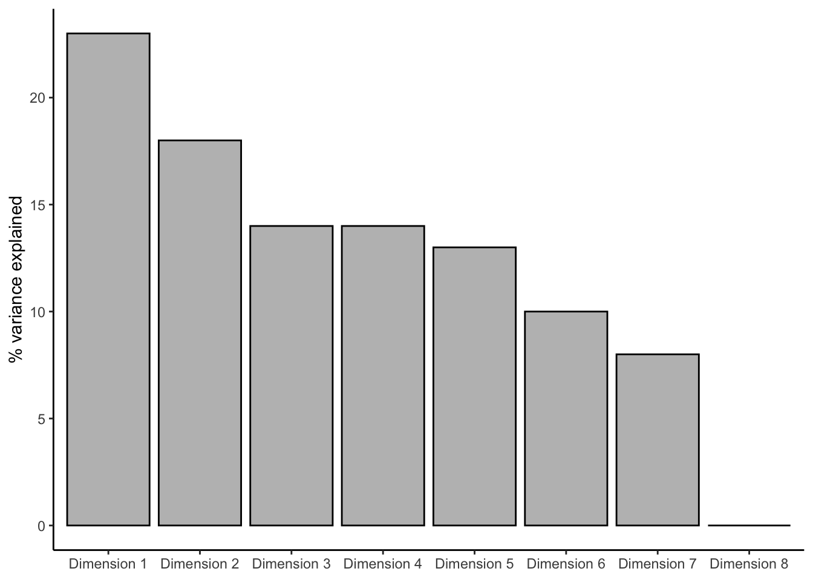
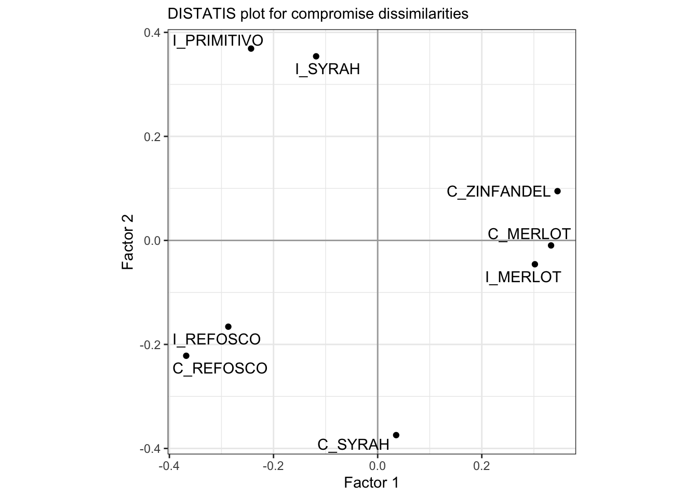
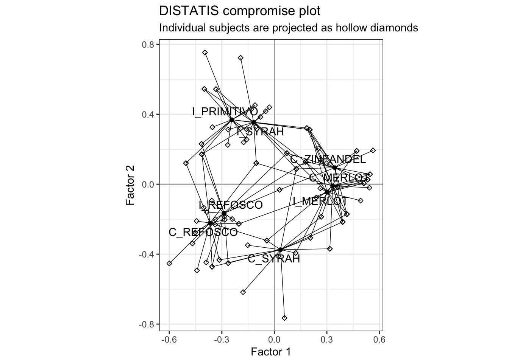
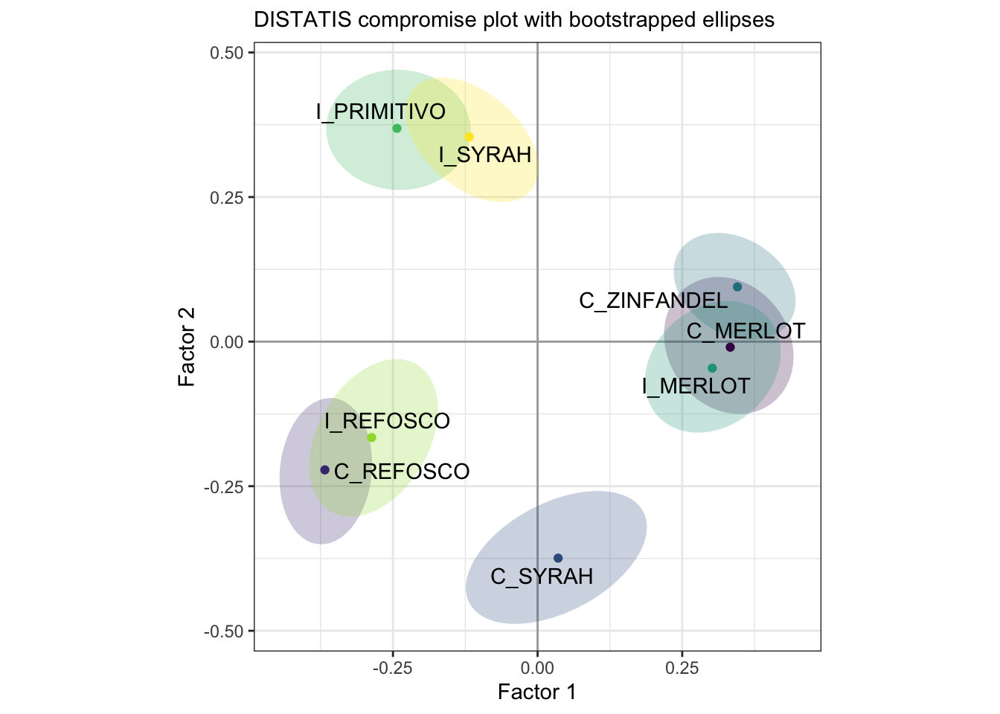
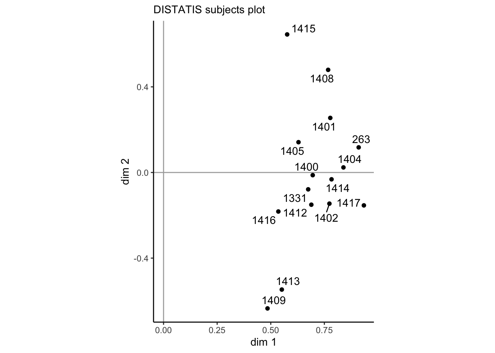
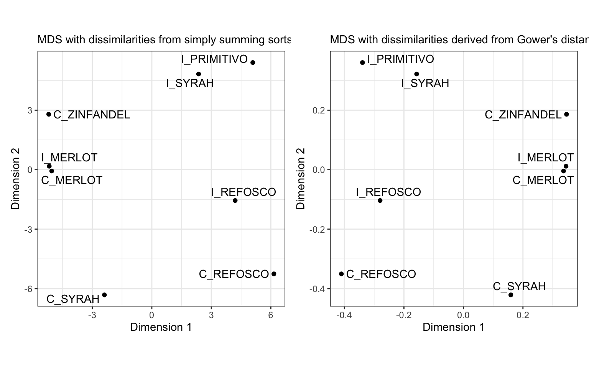
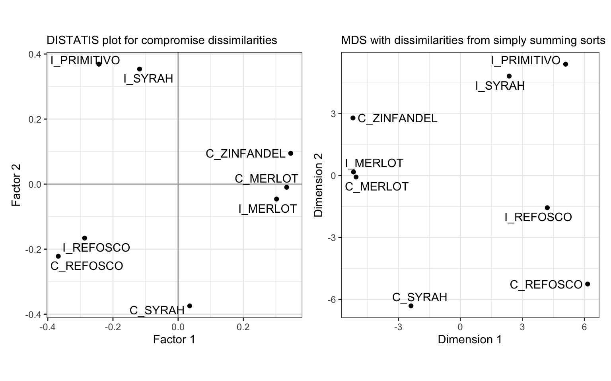

# DISTATIS

DISTATIS is the "discriminant sorting" version of STATIS, which according to @abdiSTATIS2012[p.125] is a French acronym for

> "Structuration des Tableaux à Trois Indices de la Statistique" (which can, approximately, be translated as "structuring three way statistical tables").

Whereas STATIS is a methodology that is closely related to Multiple Factor Analysis [MFA: @abdiMultiple2013], DISTATIS is a slght elaboration of the method primarily for analyzing the results of **sorting tasks**.  In a sorting task, subjects receive a set of samples all at the same time (simultaneous sample presentation) and are asked to sort them into groups.  Typically, subjects are not given specific criteria for sorting, although variations of the method do exist that specify this.  Also typically, with $n$ samples, subjects are told to make between $2$ and $n-1$ groups (i.e., they cannot say all samples are identical or all samples are different).  With this simple set of instructions, a set of 15-25 subjects can evaluate a set of samples in a relatively efficient fashion.  The results are often not as well-defined or discriminating as traditional profiling methods (Descriptive Analysis, for the most part), but as a "first look" into the structure of a sample set, sorting tasks are often quite useful.

Two further points are worth mentioning: 

1. DISTATIS can be used on any dissimilarity data, not just that from sorting tasks.  It also does not require that the dissimilarity data be *binary* (as it is in a sorting task: in a group or not in a group).  For example, DISTATIS can be used with the results of hierarchical or multiple sorting [@courcouxFree2023].  Recently, "free linking" tasks, in which pairwise-similarity is judged among a set of samples (as opposed to group-wise similarity), have also been analyzed successfully with DISTATIS: these results are also non-binary similarities.
2. DISTATIS is closely related to MDS: it is an eigendecomposition on a set of dissimilarities.  It differs primarily in data-preprocessing and in the generation of additional analytical outputs, which are often useful.  The biplots produced by MDS and DISTATIS will usually be almost identical (see below).

With that said, let's launch into our application of DISTATIS.

## The dataset: sorting wines by color

We're actually going to use another dataset for this analysis, not the results of the DA we've been analyzing so far.  We're going to load the `sorting_r1` dataset, which according to HGH is 

> color data that came from sorting the wines into similarly colored groups.

Thus, the data pertain to the same wine, but is sorted into groups *by appearance* by 15 panelists.


```r
library(tidyverse)
library(here)

sorting_data <- read_csv(here("data/sorting_r1.csv"))

sorting_data
```

```
## # A tibble: 8 × 16
##   wine      `263` `1331` `1400` `1401` `1402` `1404` `1405` `1408` `1409` `1412`
##   <chr>     <chr> <chr>  <chr>  <chr>  <chr>  <chr>  <chr>  <chr>  <chr>  <chr> 
## 1 I_REFOSCO G6    G3     G5     G4     G5     G4     G2     G2     G1     G1    
## 2 I_MERLOT  G1    G3     G4     G3     G2     G3     G4     G3     G1     G2    
## 3 I_SYRAH   G5    G4     G2     G1     G1     G2     G1     G4     G1     G2    
## 4 I_PRIMIT… G2    G1     G3     G1     G4     G5     G3     G4     G3     G2    
## 5 C_SYRAH   G3    G2     G4     G4     G5     G6     G1     G3     G2     G4    
## 6 C_REFOSCO G4    G3     G1     G2     G5     G5     G2     G1     G2     G3    
## 7 C_MERLOT  G1    G2     G3     G3     G3     G1     G4     G3     G2     G2    
## 8 C_ZINFAN… G1    G5     G3     G3     G2     G1     G1     G3     G1     G2    
## # ℹ 5 more variables: `1413` <chr>, `1414` <chr>, `1415` <chr>, `1416` <chr>,
## #   `1417` <chr>
```

It looks like the data are presented as follows: each row corresponds to 1 of the 8 wine samples we've been dealing with so far, and each column represents a panelist (coded numerically), with the cells showing which group they assigned the wine to.  So, for example, panelist `263` assigned `I_REFOSCO` to group `G6`, whereas panelist `1331` assigned the same wine to group `G3`.  You'll notice, of course, that the problem with these data are that group numbers are dependent on panelist: it doesn't matter what actual number is assigned, but rather *what other wines each panelist thinks are in the same group*.  We need some way to show this data: this is exactly transforming groups into dissimilarities.

We are going to use the `DistatisR` package for much of the analysis in this section.  It has a utility function, `DistanceFromSort()`, that will transform this kind of grouping information into dissimilarities: symmetrical matrices for each panelist that show dissimilarity.  Let's check it out:


```r
library(DistatisR)

sorting_dissimilarities <- 
  sorting_data %>%
  # As is often the case, we need to move our ID column to `rownames`
  column_to_rownames("wine") %>%
  DistanceFromSort()

# Let's take a look at what we have now
str(sorting_dissimilarities)
```

```
##  num [1:8, 1:8, 1:15] 0 1 1 1 1 1 1 1 1 0 ...
##  - attr(*, "dimnames")=List of 3
##   ..$ : chr [1:8] "I_REFOSCO" "I_MERLOT" "I_SYRAH" "I_PRIMITIVO" ...
##   ..$ : chr [1:8] "I_REFOSCO" "I_MERLOT" "I_SYRAH" "I_PRIMITIVO" ...
##   ..$ : chr [1:15] "263" "1331" "1400" "1401" ...
```

```r
# And here is a "slice" of the sorting "brick" (3D array or tensor)
sorting_dissimilarities[, , 1]
```

```
##             I_REFOSCO I_MERLOT I_SYRAH I_PRIMITIVO C_SYRAH C_REFOSCO C_MERLOT
## I_REFOSCO           0        1       1           1       1         1        1
## I_MERLOT            1        0       1           1       1         1        0
## I_SYRAH             1        1       0           1       1         1        1
## I_PRIMITIVO         1        1       1           0       1         1        1
## C_SYRAH             1        1       1           1       0         1        1
## C_REFOSCO           1        1       1           1       1         0        1
## C_MERLOT            1        0       1           1       1         1        0
## C_ZINFANDEL         1        0       1           1       1         1        0
##             C_ZINFANDEL
## I_REFOSCO             1
## I_MERLOT              0
## I_SYRAH               1
## I_PRIMITIVO           1
## C_SYRAH               1
## C_REFOSCO             1
## C_MERLOT              0
## C_ZINFANDEL           0
```

In order to deal with these data, the `DistanceFromSort()` function produces a "brick" of data (more typically called an "array" or a "tensor" in the machine-learning literature).  An array is a stack of matrices: the 3rd dimension, in this case, indexes subjects, so that `sorting_dissimilarities[, , 1]` gets the dissimilarity judgments of the first subject.  

These matrices are symmetric and contain only `0` and `1`: `0` when the row and column wines are in the same group, and `1` when they are not.  @abdiAnalyzing2007 have a demonstration that this in fact constitutes a Euclidean distance.

For subject #1, it looks like most wines were different, with only one group of 2 wines being similar by color (`C_MERLOT` and `C_ZINFANDEL`).

You'll notice that this process is much easier than the one used in the original **R Opus**.  The `DistatisR` package has matured (it incorporates the code file that HGH references) and so much of the preprocessing is now fully automatic.

## DISTATIS demonstrated

I am not going to go into all of the steps of DISTATIS [see instead @abdiAnalyzing2007], but briefly: DISTATIS first uses multivariate statistics to evaluate how similar all the subjects' sorts are to each other, then weights each subject by their similarity to the overall consensus, uses these weights to sum up the individual results into a consensus dissimilarity, and finally uses an eigendecomposition on the weighted sum to produce a map of (dis)similarities (this final step is the MDS-like part).  

This multistep approach means that not only do we have the consensus results, but we have access to results that tell us how much consensus there actually is, as well as the ability to generate bootstrapped confidence intervals based on individuals.

Luckily, the `DistatisR` package makes it quite easy to run DISTATIS.


```r
distatis_results <- distatis(sorting_dissimilarities)

# We will also generate some bootstrapped results while we're at it so as to be
# able to plot confidence ellipses.
distatis_boots <- BootFromCompromise(sorting_dissimilarities)
```

```
## [1] Starting Full Bootstrap. Iterations #: 
## [2] 1000
```

Before we proceed, let's look at what we've done:


```r
distatis_results
```

```
## **Results for DiSTATIS**
## The analysis was performed on  15 individuals, on 8 sorted items.
## *The results are available in the following objects:
## 
##   name         description                                
## 1 "$res4Cmat"  "Results from the C matrix (see notation)" 
## 2 "$res4Splus" "Results from the S+ matrix (see notation)"
## 3 "$compact"   "a boolean. TRUE if compact results used."
```

You'll notice that the output from `distatis()` is a complex list object that is reasonably well-annotated (similar to what can be found in the `FactoMineR` package outputs).  We'll dig into this in a minute.


```r
distatis_boots %>% str
```

```
##  num [1:8, 1:3, 1:1000] -0.2977 0.3056 -0.1425 -0.2006 0.0163 ...
##  - attr(*, "dimnames")=List of 3
##   ..$ : chr [1:8] "I_REFOSCO" "I_MERLOT" "I_SYRAH" "I_PRIMITIVO" ...
##   ..$ : chr [1:3] "Factor 1" "Factor 2" "Factor 3"
##   ..$ : NULL
```

```r
distatis_boots[, , 1]
```

```
##                Factor 1     Factor 2    Factor 3
## I_REFOSCO   -0.29770527 -0.226722252  0.32144205
## I_MERLOT     0.30557584 -0.021761829  0.11218988
## I_SYRAH     -0.14252528  0.389636274 -0.11405814
## I_PRIMITIVO -0.20056334  0.383101360 -0.08491339
## C_SYRAH      0.01633474 -0.386653708 -0.17660434
## C_REFOSCO   -0.34770483 -0.220891918 -0.07295109
## C_MERLOT     0.31371989  0.003792725 -0.10295863
## C_ZINFANDEL  0.35286826  0.079499348  0.11785367
```

The `BootFromCompromise()` function gives us another array: in this case a set of factor scores for the samples on the first 3 factors/components, over 1000 (the default) bootstrapped iterations.  Each slice is a single bootstrapped iteration.

Finally, let's examine our results.  The output from `distatis()` stores results about the *samples* in the `$res4Splus` list, and results about the judges in the `$res4Cmat` list.  These are named after the matrices defined in @abdiAnalyzing2007: the $\mathbf{C}$ matrix is the matrix of $RV$ coefficients between judges (a measure of multidimensional similarity), and the $\mathbf{S_+}$ matrix contains the compromise matrix of dissimilarities (after double-centering, weighting as I described above, and summing).  

Let's follow along in the order that HGH did in her workflow.  She starts by examining first the overall explained variances.  These are found in the `distatis_results$res4Splus$tau` vector.  


```r
distatis_results$res4Splus$tau %>%
  as_tibble(rownames = "dim") %>%
  mutate(dim = str_c("Dimension ", dim)) %>%
  ggplot(aes(x = dim, y = value)) + 
  geom_col(fill = "grey", color = "black", size = 1/2) + 
  theme_classic() + 
  labs(x = NULL, y = "% variance explained")
```

```
## Warning: Using `size` aesthetic for lines was deprecated in ggplot2 3.4.0.
## ℹ Please use `linewidth` instead.
## This warning is displayed once every 8 hours.
## Call `lifecycle::last_lifecycle_warnings()` to see where this warning was
## generated.
```



These results look the same as HGH's (good news!), and we can see our first two dimensions explain about 41% of the total variation in the sorts; this is fairly common for sorting, in which getting very high explanation in 2 dimensions is unlikely.

Let's look at how the products project into those first 2 dimensions.


```r
p_splus <- 
  distatis_results$res4Splus$F %>%
  as_tibble(rownames = "sample") %>%
  ggplot(aes(x = `Factor 1`, y = `Factor 2`)) + 
  geom_vline(xintercept = 0, color = "darkgrey") + 
  geom_hline(yintercept = 0, color = "darkgrey") +
  geom_point() + 
  ggrepel::geom_text_repel(aes(label = sample)) +
  coord_equal() + 
  theme_bw() + 
  labs(subtitle = "DISTATIS plot for compromise dissimilarities")

p_splus
```



These results are the same as HGH's, again, which is good news.  

HGH plotted the individual subjects as projected into this space.  It's a little annoying to do, and I do not think it is typically particularly illuminating, but we'll do it here for practice.  


```r
p_splus_augmented <- p_splus
for(i in 1:dim(distatis_results$res4Splus$PartialF)[3]){
  augmented_data <- 
    distatis_results$res4Splus$PartialF[, , i] %>%
    as_tibble(rownames = "sample") %>%
    # and then add the compromise barycenters so we can draw lines to them
    bind_cols(
      distatis_results$res4Splus$F %>%
        as_tibble() %>%
        rename(xend = 1, yend = 2)
    )
  
  p_splus_augmented <- 
    p_splus_augmented +
    geom_point(data = augmented_data, 
               shape = 23) + 
    geom_segment(data = augmented_data,
                 aes(x = `Factor 1`, y = `Factor 2`,
                     xend = xend, yend = yend),
                 size = 1/4)
}

p_splus_augmented + 
  labs(title = "DISTATIS compromise plot",
       subtitle = "Individual subjects are projected as hollow diamonds")
```



We can see how each wine's position is actually the (weighted) barycenter of all the subject's judgments about where that wine should be grouped.  We could make this more easily readable by doing some work with colors and shapes, but I rarely find this kind of plot useful or informative.  I leave this to the reader!

Before we move on to examining the subjects and comparing to MDS, let's take a look at the bootstrapped confidence ellipses we generated.


```r
# We will need to reshape these arrays into a tibble that we can more easily
# feed into `stat_ellipse()`

# I hate converting arrays to tibbles - if anyone has a better way than a loop,
# let me know
boot_tbl <- tibble()

for(i in 1:1000){
  boot_tbl <- 
    bind_rows(boot_tbl,
              distatis_boots[, , i] %>%
                as_tibble(rownames = "sample"))
}

p_splus_boots <- 
  distatis_results$res4Splus$F %>%
  as_tibble(rownames = "sample") %>%
  ggplot(aes(x = `Factor 1`, y = `Factor 2`)) + 
  geom_vline(xintercept = 0, color = "darkgrey") + 
  geom_hline(yintercept = 0, color = "darkgrey") +
  stat_ellipse(data = boot_tbl,
               aes(fill = sample), 
               show.legend = FALSE, 
               geom = "polygon",
               alpha = 1/4) +
  geom_point(aes(color = sample), show.legend = FALSE) + 
  ggrepel::geom_text_repel(aes(label = sample)) +
  coord_equal() + 
  theme_bw() + 
  labs(subtitle = "DISTATIS compromise plot with bootstrapped ellipses") +
  scale_color_viridis_d() + 
  scale_fill_viridis_d()

p_splus_boots
```



With bootstrapping, we can see that there are 4 distinct groups of samples that don't appear to overlap even when we perturb the original data.

We can now turn our consideration to the subjects: how much did they agree?  We use the $RV$ matrix to examine this.


```r
distatis_results$res4Cmat$C %>%
  round(3)
```

```
##        263  1331  1400  1401  1402  1404  1405  1408  1409  1412  1413  1414
## 263  1.000 0.461 0.564 0.855 0.718 0.778 0.568 0.730 0.333 0.651 0.569 0.614
## 1331 0.461 1.000 0.452 0.333 0.476 0.533 0.511 0.464 0.419 0.322 0.214 0.710
## 1400 0.564 0.452 1.000 0.422 0.452 0.660 0.333 0.464 0.189 0.537 0.261 0.482
## 1401 0.855 0.333 0.422 1.000 0.711 0.627 0.399 0.730 0.181 0.639 0.371 0.438
## 1402 0.718 0.476 0.452 0.711 1.000 0.533 0.466 0.464 0.419 0.645 0.475 0.507
## 1404 0.778 0.533 0.660 0.627 0.533 1.000 0.462 0.581 0.324 0.487 0.493 0.622
## 1405 0.568 0.511 0.333 0.399 0.466 0.462 1.000 0.449 0.142 0.439 0.238 0.462
## 1408 0.730 0.464 0.464 0.730 0.464 0.581 0.449 1.000 0.219 0.432 0.237 0.581
## 1409 0.333 0.419 0.189 0.181 0.419 0.324 0.142 0.219 1.000 0.272 0.601 0.502
## 1412 0.651 0.322 0.537 0.639 0.645 0.487 0.439 0.432 0.272 1.000 0.495 0.372
## 1413 0.569 0.214 0.261 0.371 0.475 0.493 0.238 0.237 0.601 0.495 1.000 0.291
## 1414 0.614 0.710 0.482 0.438 0.507 0.622 0.462 0.581 0.502 0.372 0.291 1.000
## 1415 0.581 0.309 0.309 0.504 0.309 0.493 0.360 0.827 0.068 0.174 0.077 0.493
## 1416 0.377 0.289 0.533 0.254 0.311 0.438 0.212 0.341 0.318 0.238 0.238 0.462
## 1417 0.785 0.700 0.700 0.626 0.700 0.808 0.626 0.597 0.488 0.592 0.494 0.808
##       1415  1416  1417
## 263  0.581 0.377 0.785
## 1331 0.309 0.289 0.700
## 1400 0.309 0.533 0.700
## 1401 0.504 0.254 0.626
## 1402 0.309 0.311 0.700
## 1404 0.493 0.438 0.808
## 1405 0.360 0.212 0.626
## 1408 0.827 0.341 0.597
## 1409 0.068 0.318 0.488
## 1412 0.174 0.238 0.592
## 1413 0.077 0.238 0.494
## 1414 0.493 0.462 0.808
## 1415 1.000 0.216 0.378
## 1416 0.216 1.000 0.626
## 1417 0.378 0.626 1.000
```

$RV$ is a generalization of the concept of (Pearson) correlation to multivariate data.  $RV$ coefficients between two matrices can only be positive, and is constrained to the $[0,1]$ interval, with higher values indicating more agreement.  

If we use eigendecomposition on the $RV$ matrix, the coordinates of each subject on the first dimension indicate their maximum agreement.  We can use the first 2 dimensions to examine whether there are groups of subjects, as well as how well they agree in general:


```r
p_cmat <-
  distatis_results$res4Cmat$G %>%
  as_tibble(rownames = "subject") %>%
  ggplot(aes(x = `dim 1`, y = `dim 2`)) + 
  geom_vline(xintercept = 0, color = "darkgrey") + 
  geom_hline(yintercept = 0, color = "darkgrey") + 
  geom_point() + 
  ggrepel::geom_text_repel(aes(label = subject)) + 
  coord_equal() +
  theme_classic() +
  labs(subtitle = "DISTATIS subjects plot")
  
p_cmat
```



Subjects' positions on the x-axis here are proportional to the weight their sorts receive in the final consensus plot--we can see that overall subjects largely agree, with weights between just less than `0.5` up to about `0.85`.  On the second dimension we do see a fair amount of spread, so it is obvious that there is some disagreement among subjects.  However, without some grouping variable (like level of experience in winemaking), we can't interpret whether this disagreement is systematic.

## Comparison to MDS

HGH goes on to also analyze these data via metric and non-metric MDS.  We will use metric MDS for convenience.  Because MDS requires a distance matrix, we have to convert our original sorting data into some kind of consensus.  HGH used the `cluster::daisy()` function.  Reading the `?daisy` file, it appears that this is a general dissimilarity tool.  We'll compare it to simply summing up the observed groups.


```r
daisy_data <- 
  sorting_data %>% 
  column_to_rownames("wine") %>%
  # `daisy()` does not seem to accept string data
  mutate(across(everything(), ~as.factor(.))) %>%
  cluster::daisy()

simple_data <- 
  sorting_data %>%
  column_to_rownames("wine") %>%
  DistanceFromSort() %>%
  # Here we summ across the 3rd dimension of the array, "squishing" it 
  apply(c(1, 2), sum) %>%
  dist(method = "max")

p_mds_daisy <- 
  daisy_data %>%
  cmdscale() %>%
  as_tibble(rownames = "wine") %>%
  ggplot(aes(x = V1, y = V2)) + 
  geom_point() + 
  ggrepel::geom_text_repel(aes(label = wine)) + 
  coord_fixed() + 
  labs(x = "Dimension 1", y = "Dimension 2",
       subtitle = "MDS with dissimilarities derived from Gower's distance") + 
  theme_bw()

p_mds_simple <- 
  simple_data %>%
  cmdscale() %>%
  as_tibble(rownames = "wine") %>%
  ggplot(aes(x = V1, y = V2)) + 
  geom_point() + 
  ggrepel::geom_text_repel(aes(label = wine)) + 
  coord_fixed() + 
  labs(x = "Dimension 1", y = "Dimension 2",
       subtitle = "MDS with dissimilarities from simply summing sorts") + 
  theme_bw()

library(patchwork)

p_mds_simple + p_mds_daisy
```



We can see that the dissimilarities produced from `daisy()` and from our simple sum of dissimilarities are the same except for a scale constant.

Finally, we can compare this alignment to that from DISTATIS:


```r
p_splus + p_mds_simple
```



We can see that overall our results are extremely similar, although there are some changes (the incerased spread between the Merlot wines in the DISTATIS plot, and the decreased spread between the Refosco wines).  

## Packages used in this chapter


```r
sessionInfo()
```

```
## R version 4.3.1 (2023-06-16)
## Platform: aarch64-apple-darwin20 (64-bit)
## Running under: macOS Ventura 13.6.1
## 
## Matrix products: default
## BLAS:   /Library/Frameworks/R.framework/Versions/4.3-arm64/Resources/lib/libRblas.0.dylib 
## LAPACK: /Library/Frameworks/R.framework/Versions/4.3-arm64/Resources/lib/libRlapack.dylib;  LAPACK version 3.11.0
## 
## locale:
## [1] en_US.UTF-8/en_US.UTF-8/en_US.UTF-8/C/en_US.UTF-8/en_US.UTF-8
## 
## time zone: America/New_York
## tzcode source: internal
## 
## attached base packages:
## [1] stats     graphics  grDevices utils     datasets  methods   base     
## 
## other attached packages:
##  [1] patchwork_1.1.2 DistatisR_1.1.1 here_1.0.1      lubridate_1.9.2
##  [5] forcats_1.0.0   stringr_1.5.0   dplyr_1.1.2     purrr_1.0.1    
##  [9] readr_2.1.4     tidyr_1.3.0     tibble_3.2.1    ggplot2_3.4.3  
## [13] tidyverse_2.0.0
## 
## loaded via a namespace (and not attached):
##  [1] gtable_0.3.4       xfun_0.39          bslib_0.5.1        ggrepel_0.9.3     
##  [5] lattice_0.21-8     tzdb_0.4.0         vctrs_0.6.3        tools_4.3.1       
##  [9] generics_0.1.3     parallel_4.3.1     fansi_1.0.4        cluster_2.1.4     
## [13] highr_0.10         janeaustenr_1.0.0  pkgconfig_2.0.3    prettyGraphs_2.1.6
## [17] tokenizers_0.3.0   Matrix_1.6-0       readxl_1.4.3       lifecycle_1.0.3   
## [21] compiler_4.3.1     farver_2.1.1       munsell_0.5.0      carData_3.0-5     
## [25] htmltools_0.5.6    SnowballC_0.7.1    sass_0.4.7         yaml_2.3.7        
## [29] tidytext_0.4.1     pillar_1.9.0       car_3.1-2          crayon_1.5.2      
## [33] jquerylib_0.1.4    MASS_7.3-60        cachem_1.0.8       abind_1.4-5       
## [37] tidyselect_1.2.0   digest_0.6.33      stringi_1.7.12     bookdown_0.37     
## [41] labeling_0.4.3     rprojroot_2.0.3    fastmap_1.1.1      grid_4.3.1        
## [45] colorspace_2.1-0   cli_3.6.1          magrittr_2.0.3     utf8_1.2.3        
## [49] withr_2.5.0        scales_1.2.1       bit64_4.0.5        timechange_0.2.0  
## [53] rmarkdown_2.23     bit_4.0.5          cellranger_1.1.0   hms_1.1.3         
## [57] evaluate_0.21      knitr_1.43         viridisLite_0.4.2  rlang_1.1.1       
## [61] Rcpp_1.0.11        glue_1.6.2         rstudioapi_0.15.0  vroom_1.6.3       
## [65] jsonlite_1.8.7     R6_2.5.1
```
